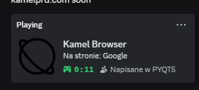


# My own personal web browser!

A long time ago i created my own web browser in PyQT5.
Simple web browser with discord rich presence. **Some sitess such may not work!**

## How its look ?
 <br>

## Authors

- just me 


## How to install 

```python
1. Install packages from requirements.txt
~  pip install -r /path/to/requirements.txt

2. Run main.py
~ python main.py

```

